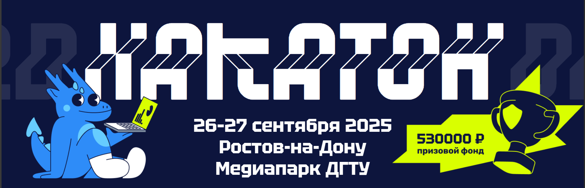
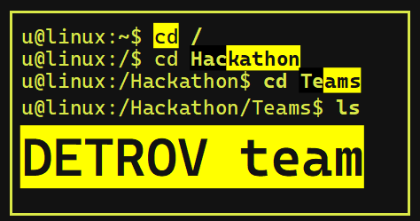
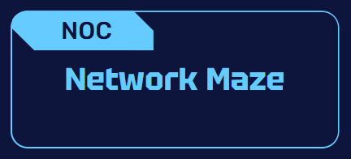
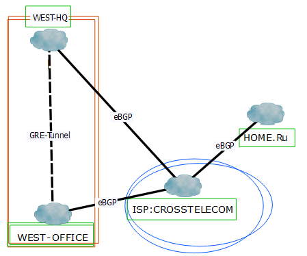
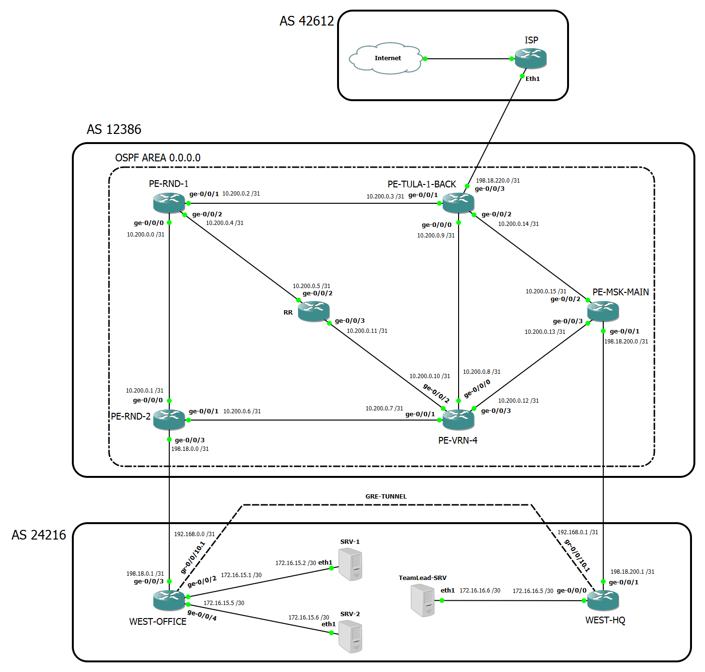
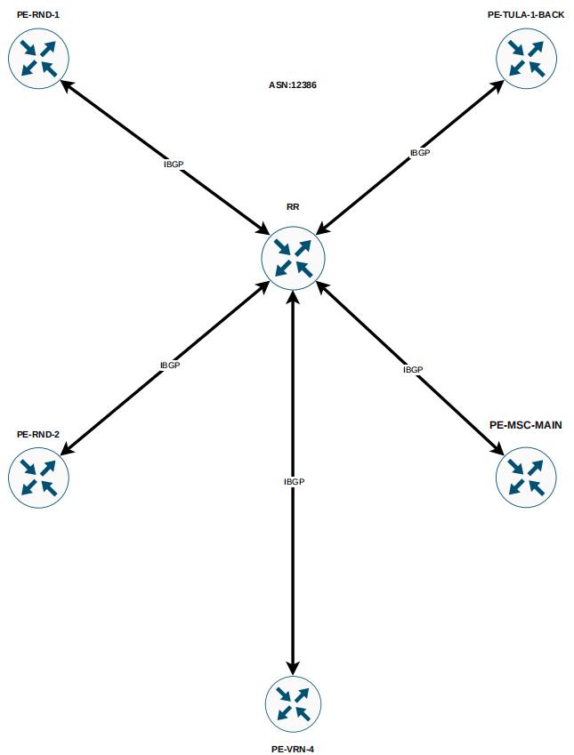

________________

## Событие:

## Команда:

- * ---> *Халеддинов Руслан (капитан)* - Сетевой администратор
- * -> *Шумейко Никита* - Сетевой инженер
- * -> *Степанов Роман* - Дизайнер, технический редактор

## Кейс:

## Сроки работы:
-  -->  **С 26 по 27 сентября**

________________

# РАБОТА НАД КЕЙСОМ

### P.S. Данная лабораторная работа проводилась с учётом следующих схем сети:

- **Схема 1. BGP связность между автономными системами**

- **Схема 2. Физическая схема коммутации**

- **Схема 3. IGP: CROSSTELECOM**

_____________________

## Проблематика:
**Потеря связности между удаленным офисом и штаб-квартирой, проблемы с доступностью узлов, а также с маршрутизацией трафика.**

## Анализ:
*В ходе анализа сети выявлены проблемы с IP-адресацией, ошибочным использованием масок подсетей и недостаточной настройкой интерфейсов.*
**Это вызывает нестабильность в маршрутизации и усложняет управление сетью.**

## Решение:
**Корректировка адресации, настройка интерфейсов JunOS, оптимизация маршрутизации BGP и OSPF.**

## Планы и рекомендаций:
- **Мониторинг сети и проактивное управление.**
- **Расширение сети с сохранением архитектуры.**
- **Внедрение дополнительных мер безопасности и оптимизации.**
- **Более детальная настройка eBGP-протокола**

_________________

# ДОКУМЕНТАЦИЯ:
...

__________

